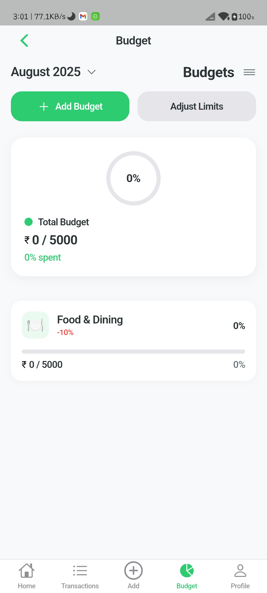

# ExpenseBuddy - Personal Finance Management App

<div align="center">
  
  <h3>Smart Expense Tracking & Budget Management</h3>
  <p>Version 1.1.0 | Flutter 3.8.1+ | Cross-Platform</p>
</div>

## 📱 Table of Contents

- [Overview](#overview)
- [Features](#features)
- [Screenshots](#screenshots)
- [Architecture](#architecture)
- [Project Structure](#project-structure)
- [Core Modules](#core-modules)
- [Screens & UI](#screens--ui)
- [Data Layer](#data-layer)
- [State Management](#state-management)
- [Services](#services)
- [Authentication](#authentication)
- [Database](#database)
- [Firebase Integration](#firebase-integration)
- [Offline Support](#offline-support)
- [Setup & Installation](#setup--installation)
- [Build & Deployment](#build--deployment)
- [Contributing](#contributing)

## 🎯 Overview

ExpenseBuddy is a comprehensive personal finance management application built with Flutter that helps users track expenses, manage budgets, and gain insights into their spending patterns. The app features a modern iOS-style design, robust offline capabilities, and seamless cloud synchronization.

### Key Highlights
- **Cross-Platform**: iOS, Android, Web, Windows, macOS
- **Offline-First**: Works without internet connection
- **Real-time Sync**: Firebase Cloud Firestore integration
- **Modern UI**: Cupertino design language
- **Secure**: Firebase Authentication with social login support
- **Responsive**: Adaptive layouts for all screen sizes

## ✨ Features

### Core Functionality
- 💰 **Expense Tracking**: Log income and expenses with categories
- 📊 **Budget Management**: Set and monitor spending limits
- 📈 **Analytics**: Visual charts and spending insights
- 🔄 **Multi-Currency**: Support for different currencies
- 📱 **Offline Mode**: Full functionality without internet
- 🔐 **Secure Authentication**: Email, Google, Apple Sign-In

### Advanced Features
- 🔔 **Smart Notifications**: Budget alerts and reminders
- 📍 **Location Tracking**: Geotag transactions
- 🌙 **Dark Mode**: Automatic theme switching
- 📊 **Data Export**: Backup and restore functionality
- 🔄 **Auto-Sync**: Background synchronization
- 📱 **Responsive Design**: Optimized for all devices

## 📸 Screenshots

<div align="center">
  <h3>📱 App Interface Preview</h3>
  <p>Explore the beautiful and intuitive design of ExpenseBuddy</p>
</div>

### 🚀 Onboarding & Authentication
| Splash Screen | Onboarding 1 | Onboarding 2 | Onboarding 3 | Login Screen |
|---------------|---------------|---------------|---------------|--------------|
|  |  |  |  |  |

### 🔐 Authentication & Setup
| Email Login | Email Signup | Forgot Password | Profile Screen | Settings |
|-------------|--------------|-----------------|----------------|----------|
|  |  |  |  |  |

### 💰 Core Features
| Home Dashboard | Add Expense | Add Income | Budget Management | Transactions |
|----------------|-------------|------------|-------------------|--------------|
|  |  |  |  |  |

### 📱 App Screenshots Gallery

<div align="center">
  <h4>🎯 Key App Screens</h4>
  <p>Experience the intuitive and modern design of ExpenseBuddy across all platforms</p>
</div>

#### 📱 **Mobile-First Design**
The app is designed with a mobile-first approach, ensuring optimal user experience across all device sizes:

- **📱 Mobile**: Optimized for smartphones (iOS/Android)
- **💻 Tablet**: Adaptive layouts for iPad and Android tablets  
- **🖥️ Desktop**: Responsive web interface for Windows/macOS
- **🔄 Cross-Platform**: Consistent experience across all platforms

#### 🎨 **Design Features**
- **Cupertino Design**: iOS-style interface with smooth animations
- **Dark/Light Mode**: Automatic theme switching based on system preferences
- **Responsive Layouts**: Adaptive UI that works on any screen size
- **Accessibility**: Built-in accessibility features for all users

**Note**: All screenshots are taken from the actual app running on different devices and orientations. The app maintains consistent design language across iOS, Android, and Web platforms.

## 🏗️ Architecture

ExpenseBuddy follows a **Clean Architecture** pattern with **BLoC (Business Logic Component)** state management, ensuring separation of concerns and maintainable code.

### Architecture Layers

```
┌─────────────────────────────────────────────────────────────┐
│                        UI Layer                             │
│  ┌─────────────┐ ┌─────────────┐ ┌─────────────────────┐  │
│  │   Screens   │ │   Widgets   │ │    Theme System     │  │
│  └─────────────┘ └─────────────┘ └─────────────────────┘  │
├─────────────────────────────────────────────────────────────┤
│                    Business Logic Layer                     │
│  ┌─────────────┐ ┌─────────────┐ ┌─────────────────────┐  │
│  │    BLoCs    │ │  Providers  │ │   Event Handlers    │  │
│  └─────────────┘ └─────────────┘ └─────────────────────┘  │
├─────────────────────────────────────────────────────────────┤
│                      Service Layer                          │
│  ┌─────────────┐ ┌─────────────┐ ┌─────────────────────┐  │
│  │   Firebase  │ │   Local DB  │ │   External APIs     │  │
│  └─────────────┘ └─────────────┘ └─────────────────────┘  │
├─────────────────────────────────────────────────────────────┤
│                       Data Layer                            │
│  ┌─────────────┐ ┌─────────────┐ ┌─────────────────────┐  │
│  │   Models    │ │ Repositories│ │   Data Sources      │  │
│  └─────────────┘ └─────────────┘ └─────────────────────┘  │
└─────────────────────────────────────────────────────────────┘
```

### Design Patterns
- **Repository Pattern**: Abstract data access
- **Dependency Injection**: GetIt for service locator
- **Observer Pattern**: BLoC for state management
- **Factory Pattern**: Model creation
- **Singleton Pattern**: Service instances

## 📁 Project Structure

```
expensebuddy/
├── 📱 android/                    # Android-specific code
├── 🍎 ios/                       # iOS-specific code
├── 🌐 web/                       # Web platform code
├── 🖥️ windows/                   # Windows platform code
├── 💻 macos/                     # macOS platform code
├── 📦 lib/                       # Main Dart source code
│   ├── 🚀 main.dart             # App entry point
│   ├── 📱 app.dart              # Main app configuration
│   ├── 🏗️ bloc/                 # BLoC state management
│   ├── 🎯 blocs/                # Business logic components
│   ├── 🎨 core/                  # Core app utilities
│   │   ├── 📏 constants/         # App constants
│   │   ├── 🛠️ helpers/          # Helper functions
│   │   ├── 🧭 router/            # Navigation routing
│   │   └── 🎨 theme/             # App theming
│   ├── 💾 data/                  # Data layer
│   │   ├── 🏠 local/             # Local database
│   │   └── ☁️ remote/            # Remote data sources
│   ├── 🔥 firebase_options.dart  # Firebase configuration
│   ├── 📊 models/                # Data models
│   ├── 🔧 providers/             # State providers
│   ├── 🧭 router/                # App routing
│   ├── ⚙️ services/              # Business services
│   ├── 🎨 ui/                    # User interface
│   │   ├── 🏠 auth/              # Authentication screens
│   │   ├── 💰 budget/            # Budget management
│   │   ├── 📊 dashboard/         # Dashboard screens
│   │   ├── 🏠 home/              # Home screen
│   │   ├── 🧭 main/              # Main navigation
│   │   ├── 📱 onboarding/        # Onboarding flow
│   │   ├── 👤 profile/           # User profile
│   │   ├── ⚙️ settings/          # App settings
│   │   ├── 💸 transactions/      # Transaction management
│   │   └── ❌ error/             # Error handling
│   ├── 🛠️ utils/                 # Utility functions
│   └── 🧩 widgets/               # Reusable widgets
├── 📚 test/                      # Test files
├── 🎨 assets/                    # App assets
│   ├── 🎭 fonts/                 # Custom fonts
│   ├── 🖼️ icons/                 # App icons
│   └── 🖼️ images/                # App images
├── 📋 pubspec.yaml               # Dependencies
├── 🔧 build.yaml                 # Build configuration
├── 📖 README.md                  # This file
└── 📚 Documentation/             # Additional docs
```

## 🧩 Core Modules

### 1. Authentication Module (`lib/ui/screens/auth/`)
- **Login Screen**: Email/password authentication
- **Email Auth Screen**: Sign up and sign in
- **Forgot Password**: Password recovery
- **Social Login**: Google and Apple Sign-In integration

### 2. Onboarding Module (`lib/ui/screens/onboarding/`)
- **Onboarding Flow**: 3-step introduction
- **User Preferences**: Initial setup and preferences
- **Welcome Experience**: Smooth first-time user journey

### 3. Transaction Module (`lib/ui/screens/transactions/`)
- **Add Transaction**: Log income/expenses
- **Transaction List**: View all transactions
- **Transaction Details**: Detailed transaction view
- **Categories**: Organized spending tracking

### 4. Budget Module (`lib/ui/screens/budget/`)
- **Budget Creation**: Set spending limits
- **Budget Tracking**: Monitor progress
- **Period Management**: Monthly/weekly budgets
- **Visual Indicators**: Progress bars and alerts

### 5. Dashboard Module (`lib/ui/screens/dashboard/`)
- **Overview**: Financial summary
- **Charts**: Spending analytics
- **Quick Actions**: Fast access to features
- **Insights**: Smart recommendations

### 6. Profile Module (`lib/ui/screens/profile/`)
- **Account Settings**: User preferences
- **Currency Settings**: Multi-currency support
- **Notification Settings**: Alert preferences
- **Privacy & Security**: Data protection
- **Help & Support**: User assistance

## 🎨 Screens & UI

### Screen Hierarchy
```
Splash Screen
├── Onboarding Flow
│   ├── Page 1: Welcome
│   ├── Page 2: Features
│   └── Page 3: Get Started
├── User Preferences Setup
├── Authentication
│   ├── Login
│   ├── Sign Up
│   └── Forgot Password
└── Main App
    ├── Home Dashboard
    ├── Transactions
    ├── Budget Management
    └── Profile & Settings
```

### UI Components
- **Cupertino Design**: iOS-style interface
- **Responsive Layouts**: Adaptive to screen sizes
- **Custom Widgets**: Reusable UI components
- **Theme System**: Light/dark mode support
- **Animations**: Smooth transitions and effects

## 💾 Data Layer

### Data Models (`lib/models/`)
- **TransactionModel**: Income/expense data
- **BudgetModel**: Budget information
- **UserModel**: User profile data
- **UserPreferencesModel**: User settings
- **CurrencyRate**: Exchange rate data
- **OnboardingModel**: Onboarding flow data

### Local Database (`lib/data/local/`)
- **SQLite Database**: Local data storage
- **Transaction Table**: Store transactions
- **Budget Table**: Store budgets
- **Indexing**: Performance optimization
- **Migration**: Database versioning

### Remote Data (`lib/data/remote/`)
- **Firebase Firestore**: Cloud database
- **REST APIs**: External service integration
- **Data Sync**: Offline-online synchronization

## 🔄 State Management

### BLoC Pattern (`lib/blocs/`)
- **UserPreferencesBloc**: User settings management
- **Event-Driven**: Reactive state updates
- **State Classes**: Immutable state objects
- **Error Handling**: Graceful error management

### Provider Pattern (`lib/providers/`)
- **TransactionProvider**: Transaction state
- **BudgetProvider**: Budget state
- **AuthProvider**: Authentication state
- **NavigationProvider**: Navigation state

### State Flow
```
User Action → Event → BLoC → State Change → UI Update
     ↓
Provider → State Change → UI Update
```

## ⚙️ Services

### Core Services (`lib/services/`)
- **FirebaseService**: Authentication & Firestore
- **LocalDatabaseService**: SQLite operations
- **UserService**: User management
- **BudgetService**: Budget operations
- **TransactionService**: Transaction operations
- **ThemeService**: Theme management
- **NotificationService**: Push notifications
- **ConnectivityService**: Network status
- **PermissionService**: Device permissions

### Service Features
- **Singleton Pattern**: Single service instances
- **Error Handling**: Comprehensive error management
- **Async Operations**: Non-blocking operations
- **Dependency Injection**: Service locator pattern

## 🔐 Authentication

### Authentication Methods
- **Email/Password**: Traditional authentication
- **Google Sign-In**: OAuth 2.0 integration
- **Apple Sign-In**: iOS ecosystem integration
- **Password Reset**: Secure recovery process

### Security Features
- **Firebase Auth**: Industry-standard security
- **Token Management**: Secure session handling
- **Data Encryption**: End-to-end protection
- **Privacy Compliance**: GDPR and privacy standards

## 🗄️ Database

### Local Database (SQLite)
```sql
-- Transactions Table
CREATE TABLE transactions (
  id TEXT PRIMARY KEY,
  title TEXT NOT NULL,
  amount REAL NOT NULL,
  category TEXT NOT NULL,
  date INTEGER NOT NULL,
  description TEXT,
  userId TEXT NOT NULL,
  currency TEXT NOT NULL,
  type TEXT NOT NULL,
  createdAt INTEGER NOT NULL,
  updatedAt INTEGER NOT NULL
);

-- Budgets Table
CREATE TABLE budgets (
  id TEXT PRIMARY KEY,
  name TEXT NOT NULL,
  icon TEXT NOT NULL,
  allocatedAmount REAL NOT NULL,
  spentAmount REAL NOT NULL,
  periodType TEXT NOT NULL,
  startDate INTEGER NOT NULL,
  endDate INTEGER NOT NULL,
  color TEXT NOT NULL,
  userId TEXT NOT NULL,
  createdAt INTEGER NOT NULL,
  updatedAt INTEGER NOT NULL,
  isSynced INTEGER NOT NULL DEFAULT 0
);
```

### Cloud Database (Firestore)
- **Collections**: Users, Transactions, Budgets
- **Real-time Updates**: Live data synchronization
- **Offline Persistence**: Local data caching
- **Security Rules**: Role-based access control

## 🔥 Firebase Integration

### Firebase Services
- **Authentication**: User management
- **Cloud Firestore**: NoSQL database
- **Cloud Messaging**: Push notifications
- **In-App Messaging**: User engagement
- **Analytics**: User behavior tracking

### Configuration
- **Platform Support**: iOS, Android, Web
- **Environment Setup**: Development/Production
- **Security Rules**: Database access control
- **Performance Monitoring**: App optimization

## 📱 Offline Support

### Offline Capabilities
- **Local Storage**: SQLite database
- **Offline-First**: Works without internet
- **Data Sync**: Background synchronization
- **Conflict Resolution**: Data consistency

### Sync Strategy
- **Queue System**: Pending operations
- **Conflict Detection**: Data versioning
- **Auto-Sync**: Background processing
- **Manual Sync**: User-triggered sync

## 🚀 Setup & Installation

### Prerequisites
- Flutter SDK 3.8.1+
- Dart SDK 3.8.1+
- Android Studio / Xcode
- Firebase project setup

### Installation Steps

1. **Clone Repository**
   ```bash
   git clone https://github.com/yourusername/expensebuddy.git
   cd expensebuddy
   ```

2. **Install Dependencies**
   ```bash
   pnpm install
   # or
   flutter pub get
   ```

3. **Firebase Setup**
   - Create Firebase project
   - Add Android/iOS apps
   - Download configuration files
   - Update `firebase_options.dart`

4. **Platform Setup**
   ```bash
   # Android
   flutter build apk
   
   # iOS
   flutter build ios
   
   # Web
   flutter build web
   ```

### Environment Configuration
- **Development**: Debug mode with test data
- **Production**: Release mode with live services
- **Staging**: Test environment configuration

## 🏗️ Build & Deployment

### Build Commands
```bash
# Development
flutter run

# Production Build
flutter build apk --release
flutter build ios --release
flutter build web --release

# Platform-specific
flutter build apk --split-per-abi
flutter build appbundle
```

### Deployment
- **Android**: Google Play Store
- **iOS**: Apple App Store
- **Web**: Firebase Hosting
- **Desktop**: Direct distribution

### CI/CD Pipeline
- **Automated Testing**: Unit and widget tests
- **Code Quality**: Linting and formatting
- **Build Automation**: Automated builds
- **Deployment**: Automated deployment

## 🤝 Contributing

### Development Guidelines
- **Code Style**: Follow Flutter conventions
- **Testing**: Write unit and widget tests
- **Documentation**: Update documentation
- **Code Review**: Submit pull requests

### Project Structure
- **Feature Branches**: Create for new features
- **Pull Requests**: Submit for review
- **Issues**: Report bugs and feature requests
- **Discussions**: Community engagement

## 📚 Additional Resources

### Documentation
- [Flutter Documentation](https://flutter.dev/docs)
- [Firebase Documentation](https://firebase.google.com/docs)
- [BLoC Documentation](https://bloclibrary.dev/)

### Community
- [Flutter Community](https://flutter.dev/community)
- [Stack Overflow](https://stackoverflow.com/questions/tagged/flutter)
- [GitHub Issues](https://github.com/yourusername/expensebuddy/issues)

---

<div align="center">
  <p>Made with ❤️ using Flutter</p>
  <p>© 2024 ExpenseBuddy. All rights reserved.</p>
</div>
